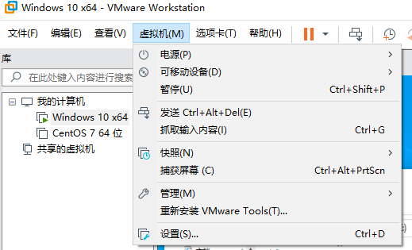
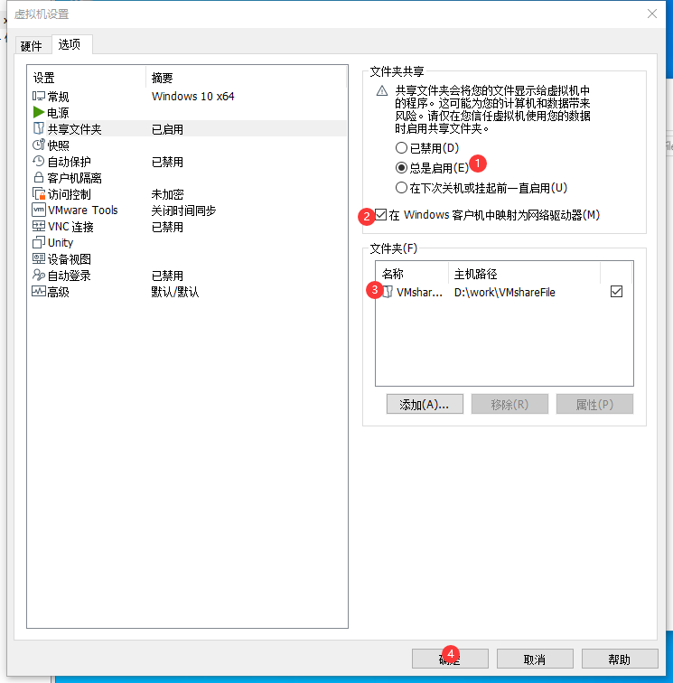

# 笔记
## QPushButton三态

调用方式
```c++
QPushButton *pBtn = new QPushButton(this);
pBtn->SetIcons(":/icon/previous.png",
                ":/icon/previous_hover.png",
                ":/icon/previous_press.png");
```
继承QPushButton实现
.h文件
```C++
#include <QPushButton>

class PicButton : public QPushButton
{
public:
    PicButton(QWidget *parent = nullptr);
    void SetIcons(const QString& normal,
                  const QString& hover, const QString& pressed);

protected:
    bool event(QEvent *e) override;

private:
    void setNormalIcon();
    void setHoverIcon();
    void setPressIcon();
    QString _normal;
    QString _hover;
    QString _pressed;

};
```
.cpp文件
```C++
#include "picbutton.h"
#include <QEvent>
PicButton::PicButton(QWidget *parent)
{

}

void PicButton::SetIcons(const QString &normal, const QString &hover, const QString &pressed)
{
    _normal = normal;
    _hover = hover;
    _pressed = pressed;

    QPixmap tmpPixmap;
    tmpPixmap.load(normal);
    this->resize(tmpPixmap.size());
    this->setIcon(tmpPixmap);
    this->setIconSize(tmpPixmap.size());
}


void PicButton::setNormalIcon(){
    QPixmap tmpPixmap;
    tmpPixmap.load(_normal);
    this->setIcon(tmpPixmap);
}

void PicButton::setHoverIcon(){
    QPixmap tmpPixmap;
    tmpPixmap.load(_hover);
    this->setIcon(tmpPixmap);
}

void PicButton::setPressIcon(){
    QPixmap tmpPixmap;
    tmpPixmap.load(_pressed);
    this->setIcon(tmpPixmap);
}

bool PicButton::event(QEvent *event)
{
    switch (event->type())
        {
        case QEvent::Enter:
            setHoverIcon();
            break;
        case QEvent::Leave:
            setNormalIcon();
            break;
        case QEvent::MouseButtonPress:
            setPressIcon();
            break;
        case QEvent::MouseButtonRelease:
            setHoverIcon();
            break;
        default:
            break;
        }
         return QPushButton::event(event);
}
```

### dynamic_cast
**dynamic_cast** 是一种运行时类型检查，用于在类继承体系中安全地进行类型转换

### 析构释放内存
保证下一页的窗体中的数据不与上一页的重复。

### 防止子窗口重复
1. 窗口模态：无法操作另外窗口，若不关掉此窗口，则无法操作。
2. 非模态窗口：可重复出现窗口

#### 解决重复出现窗口问题：
先创建一个空指针，在创建窗体的时候判断该指针是否为NULL，如果为NULL，表示窗体未创建，则创建窗体；如果不为NULL，则表示已经创建窗体，则不再创建新窗体。
**用null作为判断的条件,会默认返回false**
```C+++
// class A;
// class B;
 
void A::openB() {
    if(!mB) { // 如果为空，则需要先创建该对象
        mB = new B(this);
    }
        mB->show(); // 或者其他打开一个窗口的函数
}
```
分页的情况：需要释放内存
```C++
delete B;
B = nullptr;
```
保证下一页的窗体中的数据不与上一页的重复。

### Qt按钮左边图片右边文字
样式：
```C++
    previewCaseButton->setStyleSheet("QToolButton{"
                                     "background: #72977B;"
                                     "border-radius: 29px;"
                                     "font-family: Microsoft YaHei;"
                                     "font-weight: 400;"
                                     "font-size: 25px;"
                                     "color: #FFFFFF;"
                                     "line-height: 23px;"
                                     "background-image: url(:/images/icon/new_preview.png);"
                                     "background-repeat: no-repeat;"
                                     "background-origin: padding;"
                                     "background-position: left;"
                                     "padding-left:0px;"
                                     "border: none;"
                                     "text-align:left;"
                                     "}");
```
### 设置当前时间
实现方式：
```c++
    // 当前时间
    QString styleTime = QString("QLabel{font-family: Microsoft YaHei;\
                                font-weight: 300;\
                                font-size: 21px;\
                                color: #666666;\
                                line-height: 38px;}");

    pTimeLbl = new QLabel(this);
    pTimeLbl->setGeometry(60, 1860, 218, 25);
    pTimeLbl->setStyleSheet(styleTime);
    pTimeLbl->setAlignment(Qt::AlignCenter);

    pWeekLbl = new QLabel(this);
    pWeekLbl->setGeometry(60, 1888, 218, 25);
    pWeekLbl->setStyleSheet(styleTime);
    pWeekLbl->setAlignment(Qt::AlignCenter);

    pDataLbl = new QLabel(this);
    pDataLbl->setGeometry(60, 1923, 218, 25);
    pDataLbl->setStyleSheet(styleTime);
    pDataLbl->setAlignment(Qt::AlignCenter);

    slotUpdateTime();

    QTimer* time = new QTimer(this);
    connect(time, &QTimer::timeout, this, &Widget::slotUpdateTime);
    time->start(1000);
```
槽函数
```c++
void Widget::slotUpdateTime()
{
    QDateTime curTime = QDateTime::currentDateTime();
    pTimeLbl->setText(curTime.toString("hh:mm:ss"));
    pWeekLbl->setText(curTime.toString("dddd"));
    pDataLbl->setText(curTime.toString("yyyy-MM-dd"));

}
```

### 加密
添加头文件 #include< QCryptographicHash>
```c++
                QString MD5;
                QString passWd = newPasswdEdit->text();
                QByteArray str;
                str = QCryptographicHash::hash(passWd.toLatin1(),QCryptographicHash::Md5);
                MD5.append(str.toHex());
```

## 虚拟机共享文件
虚拟机-设置-选项-共享文件夹



## 一个QPushButton实现两种功能(按下发送按下信息，松开发送松开信号)
功能：
1. 按钮按下，显示文本框
2. 按钮再次按下，表示松开按钮，文本框隐藏

代码：
```C++
// 通过判断 mstartBtn 布尔值判断是否显示文本框问题

    connect(m_pStartBtn, &QPushButton::clicked, this, [&](){
        static bool isFlag = true;
        if (isFlag)
        {
            mstartBtn = true;   // 显示文本框
        }
        else
        {
            mstartBtn = false;  // 隐藏文本框
        }
        isFlag = ！isFlag;   ·  // 真假变换
    });
```

eg：通过判断 mstartBtn 值，实现是否绘制波形图功能
```C++
    if (mstartBtn)
    {
        if (mstartBtn == false)
        {
            m_pCustomPlot->graph(i)->data().data()->clear();
            m_pCustomPlot->xAxis->setRange(0, 10, Qt::AlignRight);
            key = 0.0;
        }
        key = time.elapsed()/1000.0;
        m_pCustomPlot->xAxis->setRange(key + 5, 10, Qt::AlignRight);
        m_pCustomPlot->graph(i)->addData(key + 5, sersor);
        m_pCustomPlot->replot();
    }
```

## Qt程序打包
https://mp.weixin.qq.com/s/n_4KVLZlH4fYL_KcWHE6EA

## 获取串口数据
```c++
#include "serialportdata.h"
#include "globalfun.h"

#include <QSerialPort>
#include <QSerialPortInfo>
#include <cmath>
#include <QDebug>

SerialPortData::SerialPortData(QObject *parent) : QObject(parent)
{

}

static SerialPortData *G_SerialPortData = nullptr;
SerialPortData *SerialPortData::instance()
{
    if (!G_SerialPortData)
    {
        G_SerialPortData = new SerialPortData();
    }
    return G_SerialPortData;
}

void SerialPortData::initSerialPortData()
{
    QList<QSerialPortInfo> infoList = QSerialPortInfo::availablePorts();

    foreach (QSerialPortInfo info, infoList)
    {
        m_strPortName = info.portName();
    }
    m_pSerialPort = new QSerialPort(m_strPortName);
    qDebug()<<"[串口!!!!]= " <<m_strPortName;

    m_pSerialPort->setBaudRate(QSerialPort::Baud115200);            // 波特率
    m_pSerialPort->setStopBits(QSerialPort::StopBits::OneStop);     // 停止位
    m_pSerialPort->setDataBits(QSerialPort::Data8);                 // 数据位
    m_pSerialPort->setParity(QSerialPort::Parity::NoParity);        // 奇偶性

    if (m_pSerialPort->open(QIODevice::ReadOnly))
    {
        qDebug("串口打开成功!!!");
        connect(m_pSerialPort, &QSerialPort::readyRead, this, &SerialPortData::slotSerialPortData);
    }
    else
    {
        qDebug("串口打开失败!!!");
    }
}

void SerialPortData::slotSerialPortData()
{
    m_bufArray = m_pSerialPort->readAll();
    QByteArray buf = m_bufArray;
    // buf 是串口传输的数据
    oscillogramParseData(buf);
}
```

## QLabel显示数字
```c++
label->setText(QString::number(10));
```

## 绝对值
```C++
int abs(int i)                      //返回整型参数i的绝对值 

double cabs(struct complex znum)    //返回复数znum的绝对值  

double fabs(double x)               //返回双精度参数x的绝对值    

long labs(long n)                   //返回长整型参数n的绝对值 
```
## 显示正负号问题
```C++
int16_t IndicationConduitDisplacement = (int16_t)twoHex(disAngledata[3], disAngledata[4]);
```
在转换数据之前强制转换int16_t。

## 类结构问题

类NodeData.h
```C++
class NodeData
{
    public:
        explicit NodeData();
        enum Type { Note = 0, Folder};

        int id() const;
        void setId(int id);

        QString fullTitle() const;
        void setFullTitle(const QString &fullTitle);

        NodeData::Type nodeType() const;
        void setNodeType(NodeData::Type newNodeType);


    private:
        int m_id;
        QString m_fullTitle;

        NodeData::Type m_nodeType;
}
Q_DECLARE_METATYPE(NodeData)
```
类NodeData.cpp
```C++
int NodeData::id() const
{
    return m_id;
}

void NodeData::setId(int id)
{
    m_id = id;
}

QString NodeData::fullTitle() const
{
    return m_fullTitle;
}

void NodeData::setFullTitle(const QString &fullTitle)
{
    m_fullTitle = fullTitle;
}

NodeData::Type NodeData::nodeType() const
{
    return m_nodeType;
}

void NodeData::setNodeType(NodeData::Type newNodeType)
{
    m_nodeType = newNodeType;
}

```

其他类调用 类NodeData
```C++
NodeData node;
node.setId(query.value(0).toInt());
node.setFullTitle(query.value(1).toString());

if (node.nodeType() == NodeData::Note) {}

```
## ini配置文件 QSettings

写入config.ini文件
```C++
    QSettings setting("./config.ini", QSettings::IniFormat);
    QString strMaxError = setting.value("MaxError").toString();
    QString strAverageError = setting.value("AverageError").toString();
    QString strNormOfError = setting.value("NormOfError").toString();
    QString strVariancer = setting.value("Variancer").toString();
```

读取config.ini文件
```c++
    QSettings setting("./config.ini", QSettings::IniFormat);
    QString strMaxError = setting.value("MaxError").toString();
    QString strAverageError = setting.value("AverageError").toString();
    QString strNormOfError = setting.value("NormOfError").toString();
    QString strVariancer = setting.value("Variancer").toString();
```